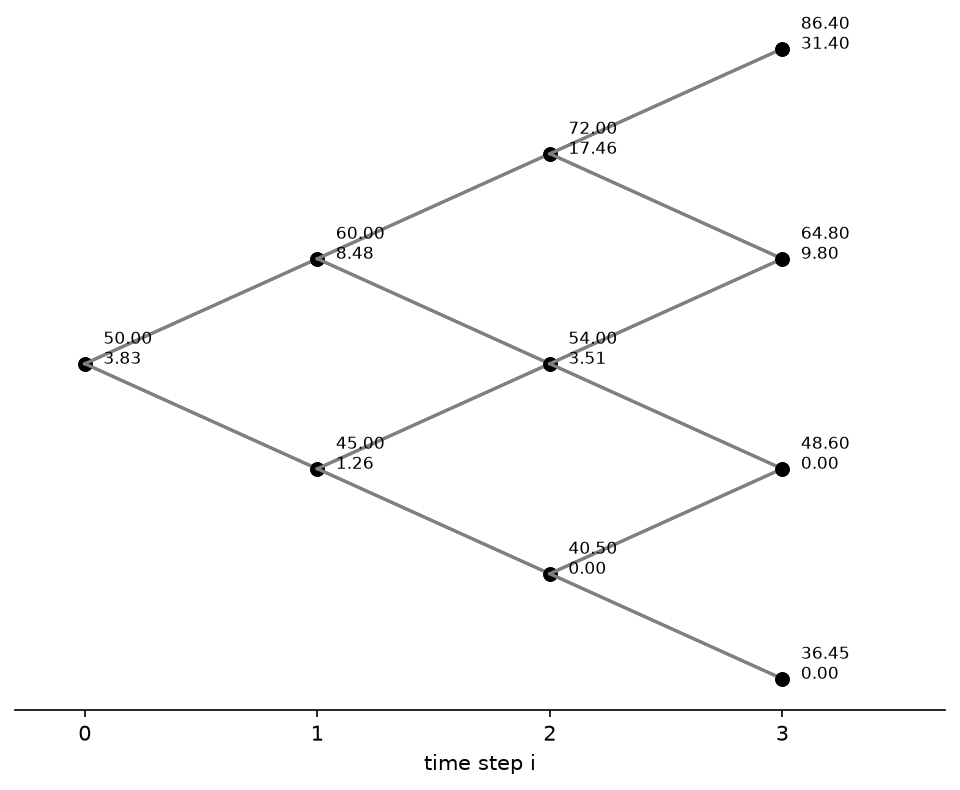
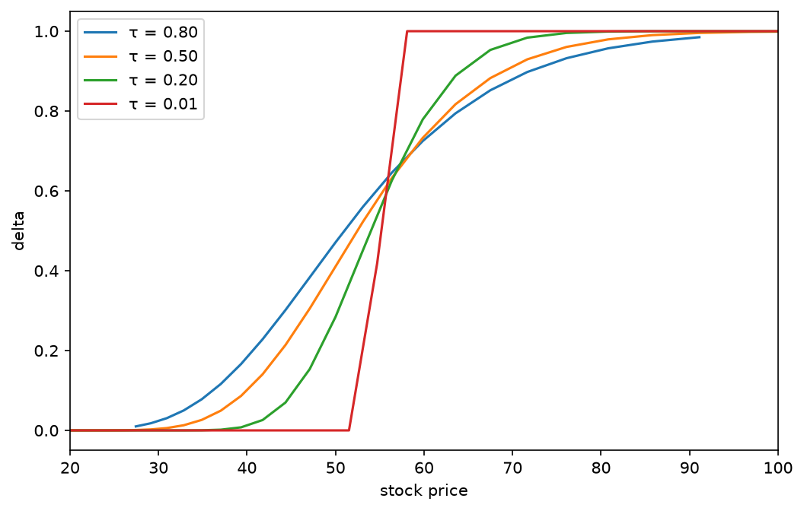
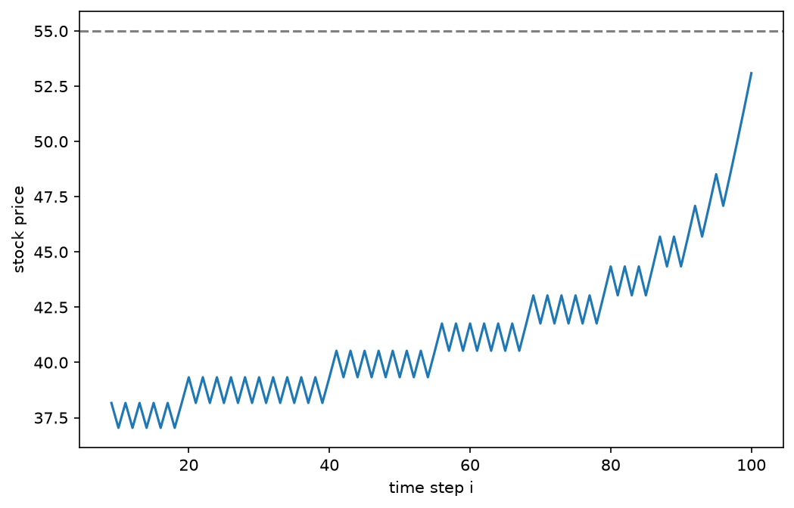
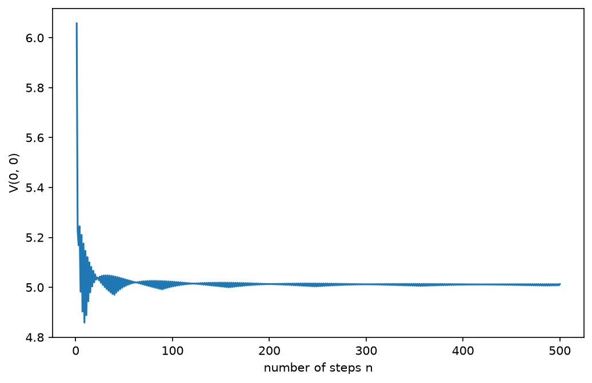
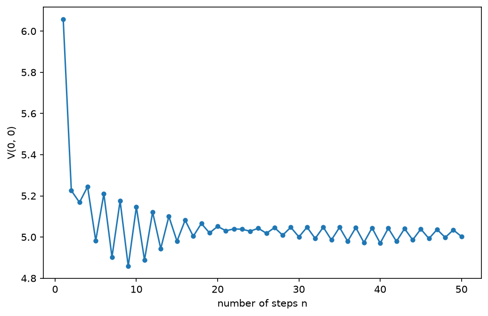

# Stage 1: Binomial Lattice Pricing

This stage builds a binomial pricer for European and American options from
first principles — no-arbitrage and replication — and checks it in three
independent ways. The code lives in `src/` (`market.py`, `single_period.py`,
`lattice.py`, `payoffs.py`), the tests in `tests/`, and the figures are
generated by `notebooks/figures.ipynb`.

Throughout, the running example is S(0) = 50, K = 55, r = 5%, with either a
fixed-step tree (u = 1.2, d = 0.9, T = 0.5) or the scaled tree of Section 3.5
(σ = 0.3, T = 1).

## 1. The one-period model and no-arbitrage

### 1.1 Setting

The one-period market is specified by the stock price S(0) with its two
time-1 outcomes S(0)u and S(0)d, and by a bond with prices A(0) and A(1).
Writing R = A(1)/A(0) for the gross return on the bond, all three assets are
measured on the same scale: u and d are the stock's gross returns in the up
and down states, and R is the bond's certain gross return. The market admits
no arbitrage if and only if

    d < R < u.

Only the ratio R enters the condition; the levels of A(0) and A(1) are
irrelevant, so the bond's unit of account has no effect on any price. This
form also does not presuppose S(0) = A(0), unlike the equivalent statement
S(0)d < A(1) < S(0)u found in the textbook.

Both inequalities are strict. Equality is already enough to construct an
arbitrage, as the two constructions below show.

### 1.2 Arbitrage when R ≥ u

Short one share of the stock and deposit the proceeds S(0) in the bond. The
net cost at time 0 is zero. At time 1 the deposit is worth S(0)R and the
short position must be closed at S(0)u or S(0)d, so the net payoff is
S(0)(R − u) in the up state and S(0)(R − d) in the down state. Since
R ≥ u > d, the first is non-negative and the second strictly positive. The
strategy costs nothing, never loses, and pays strictly more than zero with
positive probability, which is an arbitrage.

### 1.3 Arbitrage when R ≤ d

Borrow S(0) at the bond rate and buy one share. Again the net cost at time 0
is zero. At time 1 the loan is repaid at S(0)R and the share is worth S(0)u
or S(0)d, giving S(0)(u − R) in the up state and S(0)(d − R) in the down
state. Since u > d ≥ R, the first is strictly positive and the second
non-negative. This is the mirror image of 1.2.

`Market` checks d < R < u at construction and raises `ArbitrageError`
otherwise, so no pricing function ever runs on an arbitrage market.

## 2. Two routes to the price

The **replication route** solves for the pair (x, y) of stock and bond
holdings whose time-1 value matches the derivative in both states:

    x·S(0)u + y·A(1) = V_u,
    x·S(0)d + y·A(1) = V_d,

and prices the derivative at the cost of that portfolio, x·S(0) + y·A(0).
The system has a unique solution because u ≠ d.

The **risk-neutral route** computes

    q = (R − d) / (u − d)

and discounts the expected payoff under q at rate R:

    V(0) = [ q·V_u + (1 − q)·V_d ] / R.

The two agree, and not by coincidence: substituting the solution (x, y) into
x·S(0) + y·A(0) and collecting terms in V_u and V_d produces exactly the
weights q/R and (1 − q)/R. The risk-neutral probability is what falls out of
the replication argument once it is solved in general, not a separate
assumption. The no-arbitrage condition d < R < u is precisely what makes
0 < q < 1.

Implementing only the risk-neutral formula would hide this, so
`single_period.py` computes both routes independently and asserts that they
agree. The tolerance is 1e-12; the observed discrepancy on the test cases is
of order 1e-16, consistent with floating-point rounding alone.

## 3. The multi-period lattice

### 3.1 Recombination

The interval [0, T] is split into n steps of length Δt = T/n. Over each step
the stock is multiplied by u or d and the bond by R = exp(r·Δt), so every
step is a copy of the one-period market of Section 1. Because

    S(0)·u·d = S(0)·d·u,

an up-move followed by a down-move lands on the same price as the reverse
order. Layer i therefore holds only i + 1 distinct nodes instead of 2^i, and
the whole tree has

    (n + 1)(n + 2) / 2

nodes. For n = 500 this is 125,751 nodes, against 2^500 terminal paths in a
non-recombining tree. Recombination is what makes the binomial method usable
at realistic step counts.

### 3.2 Indexing convention

Node (i, j) is the node at layer i reached after j down-moves:

    S(i, j) = S(0) · u^(i−j) · d^j,    0 ≤ j ≤ i.

Within a layer, prices are stored from largest to smallest. For S(0) = 50,
u = 1.2, d = 0.9, layer 2 is [72, 54, 40.5]. The up-child of (i, j) is
(i+1, j) and the down-child is (i+1, j+1).

*Figure 1. Three-step lattice for a European call (S(0) = 50, K = 55,
u = 1.2, d = 0.9, r = 5%, T = 0.5). Each node shows the stock price (top)
and the option value (bottom). The vertical position is the net number of
up-moves, i − 2j, so that recombining paths visibly meet at the same node.*

In Figure 1 the terminal values are the payoff max(S − 55, 0) — 31.40 and
9.80 at the two upper nodes, zero below — and the root value is 3.83.

### 3.3 Backward induction

With V(n, j) = h(S(n, j)) at maturity, each earlier layer is obtained from
the next by the one-period formula of Section 2:

    V(i, j) = [ q·V(i+1, j) + (1 − q)·V(i+1, j+1) ] / R.

Both R and q are per-step quantities.

The lattice functions take (S0, u, d, r, T, n, h) directly. u, d and R are
shared by every node in the tree, while S0 only describes the root, so the
per-node prices are generated from S0 once in `stock_lattice` rather than
carried inside a market object.

### 3.4 Two memory strategies

`Euro_option_A` stores the full (n+1) × (n+1) value array and returns it.
Memory is O(n²), and every intermediate value remains available.

`Euro_option_B` keeps a single array of length n + 1 and overwrites it
layer by layer. Memory is O(n), but only V(0, 0) survives. The in-place
update computes V[j] from V[j] and V[j+1]; iterating j upward is safe
because V[j+1] has not yet been overwritten when V[j] is computed. The loop
variable `i` in this function is the number of nodes in the current layer,
not the layer index, so `range(i)` gives exactly the nodes to update.

Both are kept because they serve different purposes. When only the price is
needed, B is strictly better; Figure 2 calls it five hundred times. Anything
that looks inside the tree — the early-exercise boundary, the hedge ratios,
the self-financing check — requires A. The two implementations of the same
recursion must also agree to within 1e-12, a cross-check in the same spirit
as the two routes of Section 2.

### 3.5 Scaling u and d with the step size

Sections 3.1–3.4 treat u and d as given. When n itself varies, they cannot
stay fixed. With u = 1.2, the highest terminal node at n = 500 would be
50 × 1.2^500 ≈ 10^41: each additional step adds another full-size move, so
the total spread of outcomes grows without bound and trees with different n
describe different markets. Their prices have no reason to approach a common
limit.

The fix is to tie the size of each move to the length of the step. Given an
annual volatility σ, take

    u = exp(σ·√Δt),   d = 1/u = exp(−σ·√Δt),   Δt = T/n.

The log-return over one step is then ±σ√Δt, and over n independent steps the
variance of the total log-return is at most n·σ²·Δt = σ²T, independent of n.
Different values of n now discretise the same market at different
resolutions. The square root appears because variances of independent
increments add, so the standard deviation of a sum of n steps scales like
√n.

No-arbitrage is not automatic under this choice. d < R < u becomes, after
taking logarithms,

    |r|·Δt < σ·√Δt,   i.e.   √Δt < σ / |r|.

It fails for coarse enough steps and holds for all sufficiently fine ones.
With σ = 0.3, r = 5% and T = 1 it holds already at n = 1 (0.05 < 0.3), so
every tree used in the figures is arbitrage-free.

Figures 2–4 use this parametrisation with σ = 0.3, T = 1. The tests of
Section 5 use fixed u and d, since they check identities that hold for any
admissible parameters.

### 3.6 The replicating portfolio tree

At node (i, j) the holder sets up a portfolio of x shares and a bond
position, held until the next layer, that reproduces the option value at
both children:

    x·S(i+1, j)   + (bond position at i+1) = V(i+1, j),
    x·S(i+1, j+1) + (bond position at i+1) = V(i+1, j+1).

Subtracting,

    x(i, j) = [ V(i+1, j) − V(i+1, j+1) ] / [ S(i+1, j) − S(i+1, j+1) ].

These are the one-period replication equations of Section 2, solved once at
every node; S(i+1, j) ≠ S(i+1, j+1) guarantees a unique solution.

`portfolio_tree` stores the bond leg as B(i, j), its value at node (i, j)
rather than at the children:

    B(i, j) = [ V(i+1, j) − x(i, j)·S(i+1, j) ] / R.

Storing the value at the node, rather than a number of bonds, keeps both
legs of the portfolio quoted at the same date as the stock price at that
node, which is what the self-financing comparison of Section 5.3 needs.

Portfolios exist on layers 0 through n−1 only; no position is set up at
maturity. For the two-step example (u = 1.2, d = 0.9, T = 0.5, n = 2,
European call):

    (0, 0):  x = 0.420013,  B = −18.665810
    (1, 0):  x = 0.944444,  B = −50.366468
    (1, 1):  x = 0,         B = 0

At the root the holder buys 0.42 shares for 21.00 and borrows 18.67, a net
outlay of 2.3349, which is the option price. At (1, 1) both children are out
of the money, so the portfolio replicating a zero payoff in both states is
the empty portfolio.

The share holding x(i, j) is the hedge ratio Δ at that node.

*Figure 4. Hedge ratio Δ = x(i, j) against the stock price at four layers of
a 100-step tree (European call, S(0) = 50, K = 55, σ = 0.3, r = 5%, T = 1),
labelled by remaining time τ = (n − i)·Δt.*

Every curve lies in [0, 1] and increases with the stock price, the two
properties tested in Section 5.2. Far below the strike the option is almost
certainly worthless and needs almost no hedge; far above it the option
moves one-for-one with the stock and needs a full share. As τ shrinks the
transition around K sharpens. At τ = 0.01, one step before maturity, Δ jumps
from 0 to 1 between the nodes at 51.52 and 58.09, reproducing the slope of
the payoff max(S − K, 0), which is 0 below K and 1 above it. The curve for
τ = 0.80 covers only prices from about 27 to 91 because layer 20 of the tree
spans no further.

## 4. American options and the early-exercise boundary

### 4.1 Change to the recursion

An American holder may exercise at any node. The discounted expectation of
Section 3.3 becomes the continuation value

    C(i, j) = [ q·V(i+1, j) + (1 − q)·V(i+1, j+1) ] / R,

and the node value is the better of continuing and exercising:

    V(i, j) = max( C(i, j), h(S(i, j)) ).

At maturity V(n, j) = h(S(n, j)) as before. The tree structure and indexing
are unchanged.

### 4.2 Flagging exercise nodes

Node (i, j) is flagged as an exercise node when immediate exercise is
strictly better than continuing:

    h(S(i, j)) > C(i, j).

Ties are treated as continuation. At maturity there is no continuation, so
the condition reduces to h(S(n, j)) > 0; out-of-the-money terminal nodes are
not flagged.

The flag has to be set inside the backward loop, while C(i, j) is still
available. Once the max has been taken only the larger value remains, and
comparing V with h afterwards cannot distinguish "exercise won" from a tie.
Only the full-tree strategy is implemented for American options, since the
boundary is itself a per-node output.

### 4.3 Worked example

Put with S(0) = 50, K = 55, u = 1.2, d = 0.9, r = 5%, T = 0.5, n = 2.

At node (1, 1), S = 45, so h = 10, while the continuation value is 9.3168.
The holder exercises and V(1, 1) = 10. At node (1, 0), S = 60, h = 0 and
C = 0.6170, so the holder continues. At the root, h = 5 < C = 6.3984.

The American put is worth 6.3984, against 5.9769 for the European put, an
early-exercise premium of about 0.4215. The exercise region is
{(1, 1), (2, 1), (2, 2)}.

### 4.4 American call without dividends

With R > 1 and no dividends, the American call has the same price as the
European call (2.334853… in the example above), and no node is flagged. At
any node with m steps to maturity, put–call parity gives

    C_E = S − K/R^m + P_E ≥ S − K/R^m > S − K,

and the American continuation value is at least C_E. Continuing is always
worth more than exercising, so h > C never holds.

### 4.5 The exercise boundary

For a put, a node is worth exercising only when the stock is low enough. On
every layer of the trees used here the flagged nodes form a contiguous block
at the bottom of the layer, so each layer i that contains any exercise node
has a critical price

    B(i) = max{ S(i, j) : node (i, j) is flagged },

with exercise at or below B(i) and continuation above it. The contiguity is
checked in the notebook rather than assumed; without it B(i) would not
separate the two regions.

*Figure 3. Early-exercise boundary B(i) of an American put on a 100-step
tree (S(0) = 50, K = 55, σ = 0.3, r = 5%, T = 1). The dashed line is the
strike.*

Three features stand out.

No node is flagged before layer 9. Early in the life of the option the stock
cannot yet have fallen far enough for immediate exercise to beat waiting;
the first boundary value, at i = 9, is 38.17.

The boundary rises towards the strike as maturity approaches, reaching 51.52
at i = 99 and 53.09 at maturity, where it is simply the highest terminal
node below K. With more time left, waiting has more value — the stock may
fall further — so the stock must be lower before exercising is worthwhile.

The boundary moves in steps and saw-teeth rather than smoothly: it is 39.33
at both i = 20 and i = 50, for example. B(i) can only take values that
occur as node prices, and those form a discrete set whose position shifts by
half a grid spacing between layers of opposite parity. This is the same
discreteness that produces the oscillation of Section 6.1.

On this tree the American put is worth 7.8192 against 7.3402 for the
European put.

## 5. Validation

### 5.1 Three layers

The tests fall into three layers, in increasing order of independence from
outside information.

**Layer 1 — reference values.** Specific cases are checked against figures
worked out by hand or taken from course material: the one-period example,
the two-period European call and put, the two-period American put. These
are the easiest tests to write and the weakest evidence. They confirm only
the cases listed, and are only as reliable as the reference itself. The
quoted reference values for the two-period example (2.3350 and 6.3003)
differ from the full-precision results (2.334853… and 6.300199…) by about
1e-4, and the source of the discrepancy has not been identified; those two
tests use a tolerance of 1e-3 as a coarse check only.

**Layer 2 — structural properties.** Relations that any correct pricer must
satisfy, whatever the parameters: agreement between A and B, reduction to
`replicate` at n = 1, put–call parity, American value at least European
value, price bounds, monotonicity in the strike, and the range of the hedge
ratio. They need no external figures, so they can be checked on large trees
over many parameter sets.

**Layer 3 — self-financing.** The replicating strategy of Section 3.6 is
checked node by node on a 200-step tree.

Layer 1 lives in `test_lattice.py`, together with the A/B, n = 1, parity and
American-versus-European checks written alongside the pricers; the remaining
layer-2 properties and layer 3 are in `test_structure.py`.

### 5.2 Structural properties

**Put–call parity.** C − P = S(0) − K/R^n for European options, checked at
full precision. It ties two separate backward inductions together.

**American versus European.** The American put is never cheaper than the
European put, for K ∈ {40, 50, 55, 70} and n ∈ {1, 2, 5, 20}.

**Price bounds.** At every node, with m = n − i steps remaining,

    max( S(i, j) − K/R^m, 0 ) ≤ C(i, j) ≤ S(i, j),
    max( K/R^m − S(i, j), 0 ) ≤ P(i, j) ≤ K/R^m.

The call lower bound holds because the terminal payoff max(S − K, 0)
dominates, state by state, both the payoff of one share held against a loan
of K/R^m and the payoff of holding nothing; a price below the bound could be
arbitraged by buying the option and selling the dominated portfolio. The
other three bounds follow the same argument. These are European bounds: an
American put may exceed K/R^m, since early exercise pays K rather than its
discounted value.

**Monotonicity in the strike.** For K₁ < K₂, max(S − K₁, 0) ≥ max(S − K₂, 0)
at every terminal node and the weights in the backward recursion are
positive, so C(K₁) ≥ C(K₂). Puts go the other way. Checked at the root over
an increasing list of strikes.

**Hedge ratio.** For a call, 0 ≤ x(i, j) ≤ 1 at every node; for a put,
−1 ≤ x(i, j) ≤ 0. The numerator of x is the difference of the two child
values and the denominator the difference of the two child prices, so the
bounds say that the option value is non-decreasing in the stock price and
changes by no more than the stock price does. Both properties hold for the
terminal payoff and are preserved by the recursion. Figure 4 shows them
directly.

Strikes of 30, 50, 55 and 80 against S(0) = 50 are used for the bounds and
the hedge ratio, so that deep in-the-money, near-the-money and deep
out-of-the-money nodes are all covered. Near-the-money strikes alone would
leave x far from 0 and ±1, and the bounds would never be tested where they
are tight.

### 5.3 Self-financing

The strategy is self-financing if, at every node, liquidating the portfolio
carried in from the previous layer pays exactly for the portfolio required
going forward:

    x(p)·S(i, j) + B(p)·R = x(i, j)·S(i, j) + B(i, j),

where p is a parent of (i, j). If this holds at every node, the initial
outlay x(0,0)·S(0) + B(0,0) grows into the option payoff with no further
funding, which is what makes that outlay the no-arbitrage price.

The condition simplifies. The left-hand side is the value at (i, j) of a
portfolio constructed to be worth V(i, j) there, so it equals V(i, j) by
construction, for either parent. The test therefore reduces to

    x(i, j)·S(i, j) + B(i, j) = V(i, j)    for all 0 ≤ j ≤ i ≤ n−1,

which also covers the root, where the two sides are the initial cost and
the option price.

It matters that the check is written this way round. The obvious
formulation — roll the previous portfolio forward and compare it with V at
the new node — is an identity: x(p) and B(p) were *defined* by making that
equation hold, so it would pass whatever the backward recursion computed.

The form used is not an identity, because the two sides come from different
layers. The left-hand side is built from V(i+1, ·) through the replication
equations; substituting them and simplifying gives

    x(i, j)·S(i, j) + B(i, j) = [ q·V(i+1, j) + (1 − q)·V(i+1, j+1) ] / R.

The right-hand side, V(i, j), comes from `Euro_option_A`. Equality at every
node therefore says that replication and risk-neutral discounting produce
the same value everywhere — the multi-period version of Section 2. An error
in the recursion breaks it: with a misplaced parenthesis discounting only
the second term, node (1, 0) of the two-step example would be recorded as
6.379454 while the portfolio built from layer 2 costs 6.300199.

The test runs on European calls and puts at n = 2 and n = 200, with the
largest deviation on the order of 1e-15.

### 5.4 Tolerances

Self-financing is an internal consistency check: both sides are ordinary
floating-point results of the same magnitude, and the observed deviation is
around 1e-15, so 1e-10 is used. The structural inequalities are compared
against bounds that are attained exactly in some regions — x = 1 deep in
the money, equal prices for two strikes far out of the money — so each
inequality is relaxed by 1e-12 to absorb rounding, rather than tightened.

Absolute tolerances have to be read together with the size of the numbers
involved. Floating-point arithmetic carries a relative precision of about
1e-16, so absolute errors grow with the magnitude of the values. The
n = 200 tests use u = 1.02 and d = 0.98, giving a highest node price near
2650 and deviations below 1e-14. With u = 1.05 and d = 0.95 the highest node
price is about 823,000 and the deviation rises to 2.3e-10, which would fail
at 1e-10 without anything being wrong with the code.

## 6. Observed but not yet explained

This section records what the Stage 1 code shows but does not yet analyse.
Each item is a starting point for Stage 2.

### 6.1 Oscillation in n

*Figure 2. European call price V(0, 0) against the number of steps n, for
n = 1 to 500 (top) and n = 1 to 50 (bottom). S(0) = 50, K = 55, σ = 0.3,
r = 5%, T = 1, with u and d scaled as in Section 3.5.*

The price does not approach its limit monotonically. Consecutive values of n
give prices on alternate sides of the trend, so the sequence zig-zags: 6.058
at n = 1, 5.226 at n = 2, 5.168 at n = 3, 5.245 at n = 4. The amplitude of
the zig-zag shrinks overall, and by n = 500 the prices lie around 5.01, but
not steadily. In the full plot the envelope swells and narrows in waves, and
which parity sits above the trend changes from one wave to the next:
V(99) < V(100) but V(199) > V(200). The gap between consecutive prices is
0.0023 at n = 399, 400 and larger again, 0.0048, at n = 499, 500.

A qualitative explanation is available. Under d = 1/u the terminal prices
are S(0)·u^(n−2j), evenly spaced in log-price with spacing 2σ√Δt. For even
n the grid contains S(0) itself; for odd n it is shifted by half a spacing.
The payoff max(S − K, 0) has a kink at K, and near a kink the error of
replacing the continuous distribution by the grid depends on where K falls
between two neighbouring nodes. That position changes with every step of n
— by the half-spacing shift between parities and by the slow shrinking of
the spacing itself — so the error oscillates while the spacing, and with it
the size of the error, decreases.

What is not yet known: the limiting value, the rate at which the envelope
shrinks, and what governs the wave pattern. Stage 2 will measure the order
of convergence by regression on the error, and will need to deal with the
oscillation before applying Richardson extrapolation, which assumes the
error behaves like a smooth power of 1/n.

### 6.2 Discreteness in the exercise boundary

The steps and saw-teeth of Figure 3 come from the same source: the boundary
can only sit on node prices. It is not yet clear how fast the discrete
boundary approaches a smooth curve as n grows, or how the error in the
American price depends on it.

### 6.3 Limits of the current tests

All three validation layers check that the lattice is internally consistent
and agrees with hand calculations at small n. None of them says how close
the lattice price at a given n is to the price the model converges to.
Measuring that error is the subject of Stage 2.